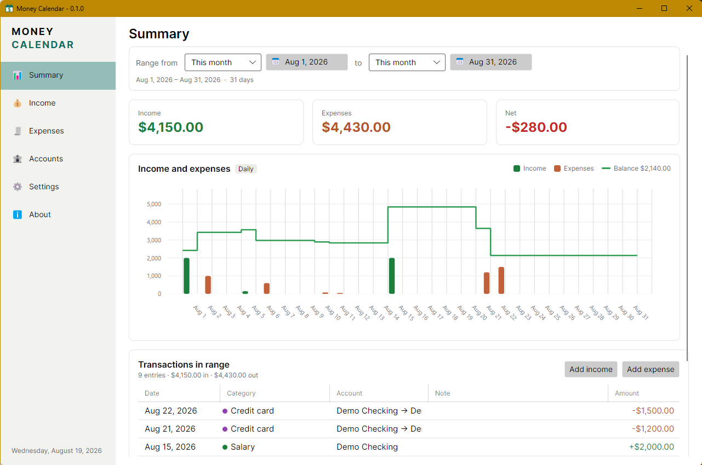

# Money Calendar

[](https://github.com/loxsmoke/money-calendar/releases)
[](https://github.com/loxsmoke/money-calendar/releases/latest)
[](https://github.com/loxsmoke/money-calendar/actions/workflows/ci.yml)
[](LICENSE)

Money Calendar is a desktop app for planning your income and expenses on a calendar and seeing where your balance lands.

Rather than recording what you already spent, you enter what you expect — a salary on the 15th, rent on the 1st, a subscription every two weeks, a one-off bill next month — and the app draws the weeks ahead: what comes in, what goes out, and what is left after each. Bills that repeat are entered once and keep appearing on their own.

Everything stays on your machine. There is no bank to connect, no account to sign up for, and nothing leaves the computer.

---



---

## Features

- **Plan months ahead** — pick any range up to three months back and three months forward and see the totals for it
- **See the balance move** — a chart of income and expenses with your running balance drawn over it, so a tight month is visible before it arrives
- **Repeating entries** — weekly, every two weeks, monthly, or twice a month; set it once and it keeps going, with an optional end date
- **Accounts** — checking, savings, investment, credit, mortgage and more, each with its own name, last four digits and note
- **Money has a direction** — every expense records which account it left and which it went to, so transfers read the way you would say them out loud
- **Categories** — Salary, Rent, Groceries and the rest are built in; add your own, rename them, give them colors
- **Backup and export** — a JSON backup that restores everything, or a flat CSV for spreadsheets
- **Light and dark themes**
- **Your data, your disk** — a single local file you can copy, back up or delete

---

## Requirements

| Requirement | Version |
|---|---|
| Windows | 10 or 11 (x64) |
| .NET SDK (to build) | 10.0 or later |

The interface is built with Avalonia, so nothing about it is Windows-bound in principle — but Windows is the only platform it has been run on.

---

## Getting started

```
run.cmd                    # build and launch (Debug)
run.cmd -c Release
dotnet test MoneyCalendar.slnx
```

The first launch opens on an empty ledger — no invented accounts, no invented entries. If you want something to look at first, **Settings → Developer → Load sample data** fills it with a small demo ledger: a couple of accounts, a salary and the usual standing bills, and a few payments still ahead. It only loads into an empty ledger, so it can never mix itself into your own books. **Settings → Data → Delete all transactions** clears the transactions, and **Delete all data** clears the accounts too; both ask you to type `delete` first.

---

## Using it

**Summary** — the totals for a date range, and a bar chart breaking them down with your balance drawn across it as a line: income lifts it, expenses pull it down. The balance starts from everything recorded before the range, so it picks up where your money actually is. Each end of the range moves by whole months or jumps to any date you pick from the calendar beside it. Short ranges are shown day by day, longer ones week by week.

**Income** — every payment coming in over the range you choose, with the totals, the average per day, the largest single entry and a breakdown by type across the top. Repeating income is marked, and one click narrows the list to just the repeating entries. Each entry says which account the money landed in.

**Expenses** — the same screen for money going out, and each expense records the whole flow: out of one account, into another. The list shows it as `Everyday Checking ••••1042 → Sapphire Visa ••••4417`.

**Accounts** — the accounts you keep track of, grouped by type, each showing what has come into it so far. Deleting an account never quietly cuts its transactions loose: if any are filed under it, the app offers to move them to another account of the same kind first.

**Repeating entries** — mark any entry as repeating and its date becomes the start of a series: weekly or fortnightly on a chosen weekday, monthly on a chosen day, or twice a month on two days — where the second can be mid month or the last day, whatever that turns out to be. "The 31st" lands on the 28th in February. Editing one occurrence edits the whole series, and so does deleting one.

**Settings** — the theme, your categories, a count of what the app is holding, and export and import. Two delete buttons live here, both red and both asking you to type the word first: one clears the transactions, the other clears the accounts too.

**About** — which build is running, links to this repository, and a system-info table with a copy button for filing bug reports.

---

## Where your data lives

```
%APPDATA%\MoneyCalendar\money-calendar.db      the ledger
%APPDATA%\MoneyCalendar\settings.json          theme and preferences
%APPDATA%\MoneyCalendar\logs\                  rolling log files, 14 days
```

Copy the `.db` file and you have copied everything. Delete it and the app starts over.

You can keep more than one. **Settings → Developer → Databases** lists them and lets you add,
clone, rename, delete and switch — useful for separate books, or for taking a copy before trying
something you might regret. The app remembers which one you were on.

---

## Project structure

```
money-calendar/
├── MoneyCalendar.slnx           Solution file
├── run.cmd                      Build and launch
├── docs/SPEC.md                 Full specification: schema, calculations, formats
├── src/
│   ├── MoneyCalendar.Core/      Entities, summary aggregation, export/import, seed data
│   ├── MoneyCalendar.Data/      EF Core + SQLite: context, repositories, bootstrap
│   └── MoneyCalendar.App/       Avalonia UI: shell, six sections, dialogs, themes
├── tests/MoneyCalendar.Tests/   xUnit: repositories, summaries, export/import, headless UI
└── tools/make-icon.py           Redraws the app icon (a calendar with dollar-sign days)
```

[docs/SPEC.md](docs/SPEC.md) is the reference for how it all works: the database schema, every calculation the app performs, the backup and CSV formats, and the rules behind each screen.

The app icon is generated rather than drawn: `python tools/make-icon.py` writes an `.ico` holding two versions — four dollar signs laid out like days for 32px and up, a single one below that, where four marks would blur together.

---

## Known limitations

These are deliberate simplifications, not oversights:

- **The database is not encrypted.** It is a plain local file. Use the JSON backup if the data needs to travel.
- **No schema migrations.** The database is created once; a schema change means starting from a fresh file, so export first and import after.
- **Currency is fixed to USD.** The setting exists internally but has no UI yet.
- **Amounts are always positive** — each entry carries its direction separately, which suits typed-in rows better than a signed convention.
- `SQLitePCLRaw.lib.e_sqlite3` reports the known NU1903 advisory; it is not treated as an error here.

---

## License

MIT — see [LICENSE](LICENSE).
